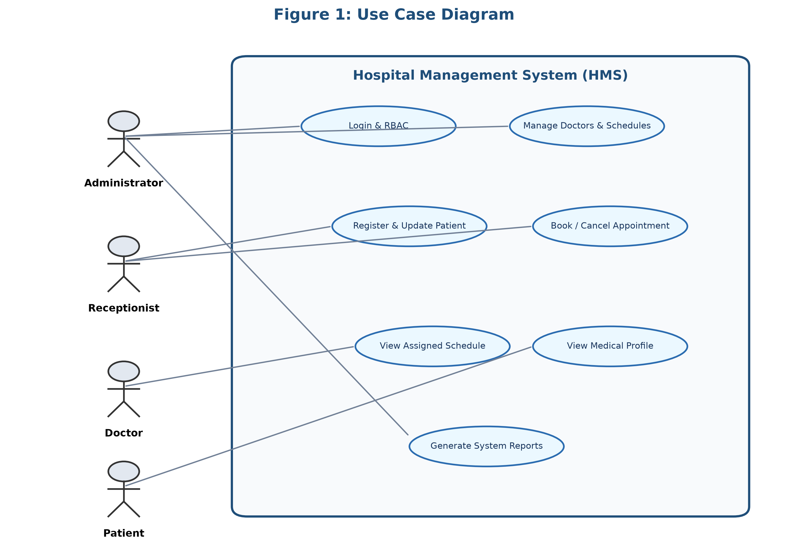
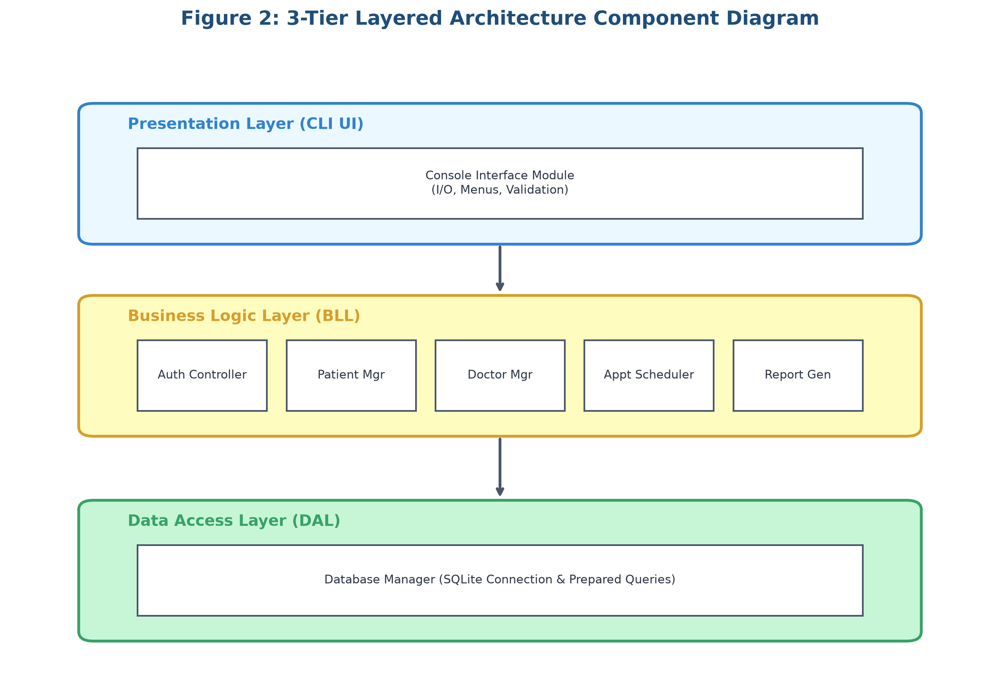
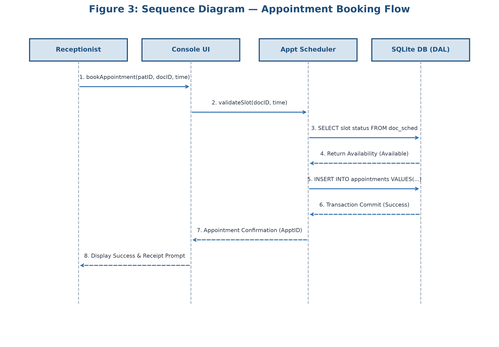

# Hospital Management System (HMS)
  
> A patient record and appointment management system for hospitals.

## Table of Contents
1. [Project Overview](#1-project-overview)
2. [Scope](#2-scope)
3. [Key Features](#3-key-features)
4. [Our Approach and Why](#4-our-approach-and-why)
5. [Deliverables](#5-deliverables)
6. [Summary Metrics](#6-summary-metrics)
7. [Repository Structure](#7-repository-structure)
8. [System Overview](#8-system-overview)
9. [Traceability Overview](#9-traceability-overview)
10. [Getting Started](#10-getting-started)
11. [Team](#11-team)
12. [References](#12-references)
13. [License and Acknowledgements](#13-license-and-acknowledgements)

## 1. Project Overview
The Hospital Management System (HMS) is designed to streamline administrative and clinical workflows within a hospital environment. It addresses the inefficiencies of manual record-keeping by providing a centralized platform for managing patient records, doctor schedules, and appointment bookings. The system primarily aids hospital administrators, receptionists, doctors, and patients in ensuring smooth operational logistics.

By digitizing these core processes, the HMS reduces scheduling conflicts and administrative overhead, ensuring that patient data is securely stored and readily accessible. The application is developed as a console-based solution using C/C++ with SQLite for robust local data persistence.

## 2. Scope

**In-Scope:**
- Patient registration and records management
- Doctor management and scheduling
- Appointment booking, cancellation, and rescheduling
- Login with role-based access control
- Basic report generation

**Out-of-Scope:**
- Billing and pharmacy
- Online payments

## 3. Key Features
- **Auth:** Secure login system with Role-Based Access Control (RBAC) for Administrators, Receptionists, and Doctors.
- **Patient:** Comprehensive patient registration, profile management, and medical record indexing.
- **Doctor:** Maintenance of doctor profiles, specializations, and availability schedules.
- **Appointment:** Real-time appointment scheduling, conflict resolution, cancellation, and rescheduling.
- **Reports:** Generation of daily operational metrics and appointment summaries.
- **Security:** Enforcement of password hashing, input sanitization, and parameterized database queries.

## 4. Our Approach and Why

**Development Process:** We adopted a sequential, documentation-first approach (Requirements → Test Planning → Architecture & Design). This order ensures that each phase acts as a foundation for the next. Defining requirements first provides clear testing objectives, and early test planning ensures the architecture is designed with testability in mind, maintaining strict traceability throughout.

**Requirements Approach:** Requirements are strictly bifurcated into Functional (FR) and Non-Functional Requirements (NFR). All statements use mandatory "shall" phrasing and are accompanied by measurable acceptance criteria. We utilize a rigid ID scheme (`FR-xxx`, `NFR-xxx`, `SEC-xxx`, `UC-xx`, `TC-xx`, `COMP-xx`) to ensure unambiguous referencing.

**Technology Stack (C/C++ & SQLite):** C/C++ was selected for its performance, memory management control, and appropriateness for building high-performance console applications. SQLite was chosen over file-based storage for its ACID compliance, built-in referential integrity, and protection against data corruption.

**Architecture Pattern:** We implemented a 3-Tier Layered Architecture (Presentation Layer, Business Logic Layer, Data Access Layer). 
1. *Separation of Concerns:* UI logic is entirely decoupled from data persistence.
2. *Maintainability:* Changes in the database schema only affect the Data Access Layer.
3. *Security:* The Business Logic Layer can enforce RBAC before data reaches the Presentation Layer. 
*Alternatives Rejected:* A monolithic architecture was rejected due to its lack of scalability and poor separation of concerns.

**Security-First Approach:** Security is embedded at the foundational level. The system utilizes RBAC to restrict module access, enforces password hashing (SHA-256) for stored credentials, maintains audit logging for critical actions, and strictly uses parameterized queries to thwart SQL injection vulnerabilities.

**Test-Planning Approach:** The testing strategy encompasses multiple levels (Unit, Integration, System). It primarily utilizes black-box testing techniques for user workflows and includes explicit security validation steps (e.g., fuzzing inputs) to verify the system's robustness against malicious attacks.

**Traceability Approach:** A rigorous Requirements Traceability Matrix (RTM) maps the lifecycle of a feature: Requirement → Use Case → Component → Test Case. This guarantees that every requirement is designed, implemented, and verified, leaving no orphaned features.

## 5. Deliverables

| # | Deliverable | Standard | File/Link | Description |
|---|---|---|---|---|
| 1 | Software Requirements Specification | IEEE 830 / ISO 29148 | [docs/SRS/HMS_SRS_v1.0.docx](docs/SRS/HMS_SRS_v1.0.docx) | Intro, FRs/NFRs, UML Use Case diagram, security objectives. |
| 2 | Software Test Plan | IEEE 829 | [docs/TestPlan/HMS_TestPlan_v1.0.docx](docs/TestPlan/HMS_TestPlan_v1.0.docx) | Testing strategy, security validation, traceability to SRS. |
| 3 | Software Architecture and Design | IEEE 1016 | [docs/Architecture_Design/HMS_ArchDesign_v1.0.docx](docs/Architecture_Design/HMS_ArchDesign_v1.0.docx) | Component diagrams, layered architecture, 2 sequence diagrams, API/DB design. |
| 4 | Test Cases (in Test Plan) | IEEE 829 | [docs/TestPlan/HMS_TestPlan_v1.0.docx](docs/TestPlan/HMS_TestPlan_v1.0.docx) | 14 test cases spanning functional workflows (Auth, Patient, Doctor, Appointments), NFRs (Performance, Memory Safety), and Security (SQLi). |

**Phase-1 Checklist Items:**
- **Problem Statement Analysis & Feasibility:** Located in SRS (Section 1 & 2)
- **SRS List (FR/NFR Categorization):** Located in SRS (Section 3)
- **Number of Actors & Names:** Located in SRS (Section 2.3) - 4 Actors (Patient, Receptionist, Doctor, Administrator)
- **Use Cases Grouped by Actor:** Located in SRS (Section 3.1)
- **Use Case Diagram:** Located in SRS (Appendix/Section 3)
- **Validation Spec:** Located in Test Plan (Section 5)
- **RTM Table:** Located in Test Plan (Section 5)

## 6. Summary Metrics

| Metric | Count |
|---|---|
| Functional Requirements (FRs) | 20 |
| Non-Functional Requirements (NFRs) | 6 |
| Security Requirements (SEC) | 3 |
| Use Cases | 14 |
| Actors | 4 (Patient, Receptionist, Doctor, Administrator) |
| Test Cases | 14 |
| Sequence Diagrams | 2 |
| Architecture Components | 5 |

## 7. Repository Structure

```text
.
├── README.md
├── diagrams/
│   ├── use_case_diagram.png
│   ├── component_diagram.png
│   └── sequence_diagram.png
└── docs/
    ├── Architecture_Design/
    │   └── HMS_ArchDesign_v1.0.docx
    ├── SRS/
    │   └── HMS_SRS_v1.0.docx
    └── TestPlan/
        └── HMS_TestPlan_v1.0.docx
```

## 8. System Overview


*Figure 1: UML Use Case Diagram showing actors and their interactions with the system.*


*Figure 2: Component Diagram illustrating the 3-Tier Layered Architecture.*


*Figure 3: Sequence Diagram detailing the Appointment Booking workflow.*

## 9. Traceability Overview

| Requirement ID | Use Case ID | Component ID | Test Case ID | Status |
|---|---|---|---|---|
| FR-AUTH-01 | UC-01 | COMP-01 | TC-AUTH-01 | Verified |
| FR-PAT-01  | UC-02 | COMP-02 | TC-PAT-01  | Verified |
| FR-APP-02  | UC-05 | COMP-04 | TC-APP-02  | Verified |
| SEC-REQ-02 | UC-01 | COMP-05 | TC-SEC-01  | Verified |

## 10. Getting Started

### Prerequisites
- **Compiler:** GCC 11.4+ / Clang 14+ with C++17 support
- **Database:** SQLite3 development library (`libsqlite3-dev` on Linux, `sqlite3` on macOS/Windows)
- **Build Tools:** `make` or `cmake` (>= 3.20)

### Build & Run Instructions (Phase 2 Preview)
```bash
# Clone the repository
git clone https://github.com/PES-H12/Hospital-Management-System.git
cd Hospital-Management-System

# Compile the project
g++ -std=c++17 -Wall -Wextra src/*.cpp -lsqlite3 -o hms_app

# Execute the console application
./hms_app
```

*Note: Phase 1 covers documentation, requirements, and architectural design only. Full code implementation and execution binaries will be delivered in Phase 2.*

## 11. Team

| Name | Roll No | Role | Contributions |
|---|---|---|---|
| Supreeth K | PES1UG24CS483 | Requirements Lead & Analyst | Problem statement analysis, elicitation of 20 FRs and 9 NFRs/SEC requirements, actor profiling, and IEEE 830 SRS documentation. |
| Shashank K | PES1UG24CS434 | Systems & Database Architect | 3-Tier Layered Architecture specification, PlantUML component modeling, SQLite database ERD design, and IEEE 1016 document authoring. |
| Shashank D | PES1UG24CS433 | QA & Verification Engineer | IEEE 829 Software Test Plan development, 14 functional & non-functional test cases design, and Requirements Traceability Matrix (RTM) construction. |
| Sumukh Shandilya | PES1UG24CS481 | Security Lead & Tooling Engineer | Security architecture (RBAC, SHA-256 hashing, SQLi mitigation), documentation build automation, repository structuring, and deliverable compilation. |

## 12. References
- IEEE Std 830-1998 / ISO/IEC/IEEE 29148:2018 (Software Requirements Specifications)
- IEEE Std 829-2008 (Software and System Test Documentation)
- IEEE Std 1016-2009 (Information Technology—Systems Design—Software Design Descriptions)

## 13. License and Acknowledgements
- **Course:** Software Engineering (V Semester)
- **Institution:** Department of Computer Science and Engineering, PES University
- **Faculty & Mentors:** Course Faculty and Lab Instructors, Department of CSE, PES University
- **License:** Academic Use Only — PES University SE Mini-Project
